University: [ITMO University](https://itmo.ru/ru/)
Faculty: [FICT](https://fict.itmo.ru)
Course: [Cloud platforms as the basis of technology entrepreneurship](https://) ADD link
Year: 2025/2026
Group: U4225
Author: Meshcheryakova Tatiana Sergeevna
Lab: Lab1
Date of create: 25.11.2025
Date of finished: 25.11.2025

# Лабораторная работа №1 — Обзор Google Cloud и исследование основных сервисов

## Тема: Базовые возможности Google Cloud
**Цель работы:** Получить практический опыт работы с основными сервисами облачной платформы GCP, включая управление доступом (IAM), создание виртуальных машин (Compute Engine) и взаимодействие с хранилищем (Cloud Storage) с целью демонстрации принципов безопасности.
**Инструменты:** Google Cloud Console, IAM, Service Accounts, Compute Engine, gsutil, GitHub.

---

## 1. Введение

Данная лабораторная работа направлена на освоение критически важных для облачной разработки концепций: **IAM (Identity and Access Management)**, **Service Accounts** и инфраструктурных сервисов, таких как **Compute Engine** и **Cloud Storage**. Я должна была не только создать необходимые ресурсы, но и экспериментально доказать, что роли, назначенные Service Account, строго контролируют доступ к другим сервисам в моей облачной среде

---

## 2. Создание GitHub-пространства для лабораторных работ

Согласно требованиям оформления, я начала работу с создания структурированного репозитория на GitHub, который будет служить единым пространством для всех материалов курса.

1.  **Создание репозитория:** Я создала новый репозиторий с именем, соответствующим требованиям методички (учебный год, курс, группа, ФИО).
    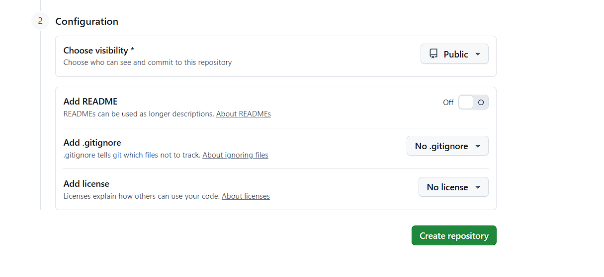
2.  **Добавление обязательных файлов:** Я добавила три обязательных файла, которые необходимы для любого проекта:
    * **`.gitignore`:** Исключает служебный мусор (например, временные файлы и папки `__pycache__`).
    * **`README.md`:** Содержит описание репозитория, целей и структуры проекта.
    * **`LICENSE`:** Я выбрала лицензию MIT, которая является разрешительной и подходит для учебных проектов.
    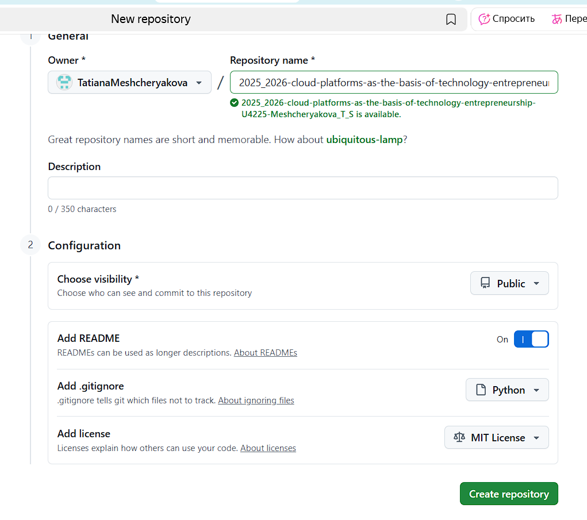
    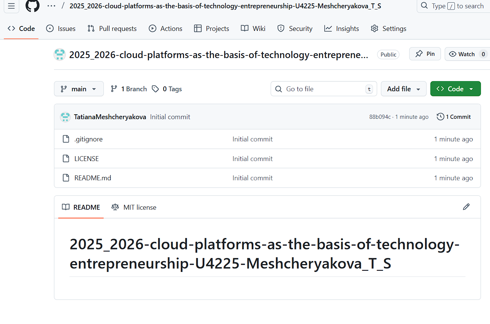

> **Вывод:** Создание структурированного репозитория гарантирует, что исходный код будет чистым, а условия использования — понятными.

---

## 3. Получение доступа к Google Cloud

Я успешно прошла процедуру заполнения формы, что дало мне необходимый доступ к проекту в Google Cloud Console.

* **Доступ:** Я получила права для создания и управления ресурсами в рамках выделенного проекта.
* **Консоль:** Первое открытие консоли подтвердило готовность среды для начала работы.

---

## 4. Создание Service Account (роль Storage Admin)

Для обеспечения авторизации виртуальной машины (VM) в Cloud Storage я создала Service Account (SA) с необходимыми правами.

1.  **Навигация:** Я перешла в раздел **"IAM & Admin"** $\rightarrow$ **"IAM"** для создания SA.
2.  **Нейминг:** Я назвала Service Account в соответствии с требованием: `tmescheryakova-sa-lab1`.
3.  **Присвоение роли:** Я назначила SA роль **`Storage Admin`**.
    * **Логика IAM:** Эта роль дает полные права на чтение и запись объектов в Cloud Storage, что является **обязательным** для успешного выполнения команды копирования на Шаге 6.
    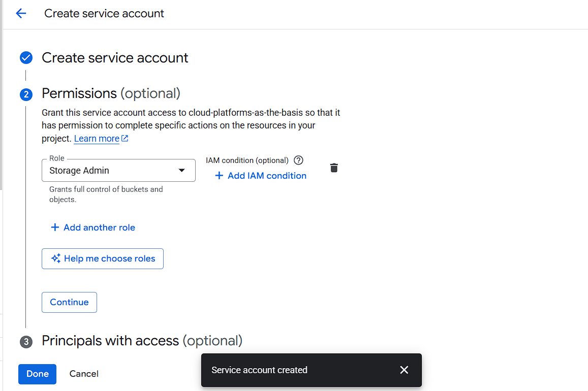
    

---

## 5. Создание виртуальной машины (Compute Engine)

Я развернула виртуальную машину, которая будет выполнять операции с хранилищем, используя удостоверение SA.

1.  **Навигация:** Я перешла в раздел **"Compute Engine"** $\rightarrow$ **"VM instances"**.
    
2.  **Параметры:**
    * **Имя:** `tmescheryakova-vm-lab1`.
    * **Тип:** `e2-micro` (минимальный и экономичный).
    * **Режим:** **Spot VM** (для экономии средств, так как VM нужна ненадолго).
    
3.  **Настройка доступа:** В разделе **"Identity and API access"** я привязала Service Account `tmescheryakova-sa-lab1` к VM, чтобы машина могла действовать от его имени.
    
4.  **Запуск:** После успешного создания VM перешла в статус **Running**.
    

---

## 6. Копирование файлов из бакета через gsutil

Я подключилась к VM через SSH и использовала команду `gsutil cp` для проверки наличия прав `Storage Admin`.

1.  **Копирование (Попытка 1):** Моя первая попытка скопировать файлы с заранее известными именами (`file1.txt`, `file2.txt`, `file3.txt`) завершилась ошибкой.
    
    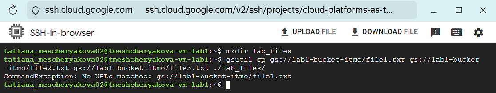

2.  **Копирование (Исправлено):** Я исправила команду, используя подстановочный знак (`*`), так как файлы имели другие имена (`pic1.jpg`, `pic2.jpg` и т.д.):
    ```bash
    gsutil cp gs://lab1-bucket-itmo/* ./lab_files/
    ```
    
    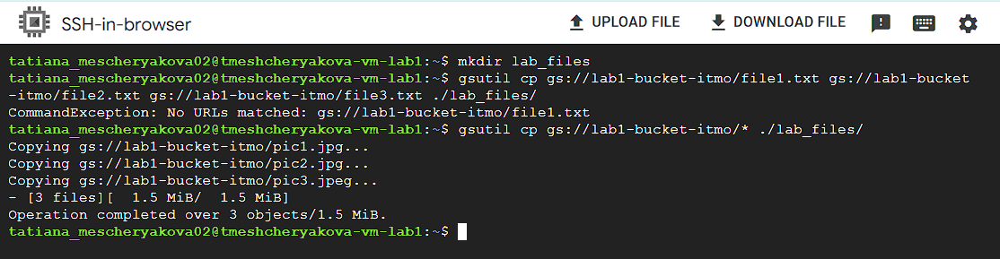

3.  **Проверка:** Я убедилась, что файлы успешно загружены на VM:
    ```bash
    ls -lah ./lab_files/
    ```
    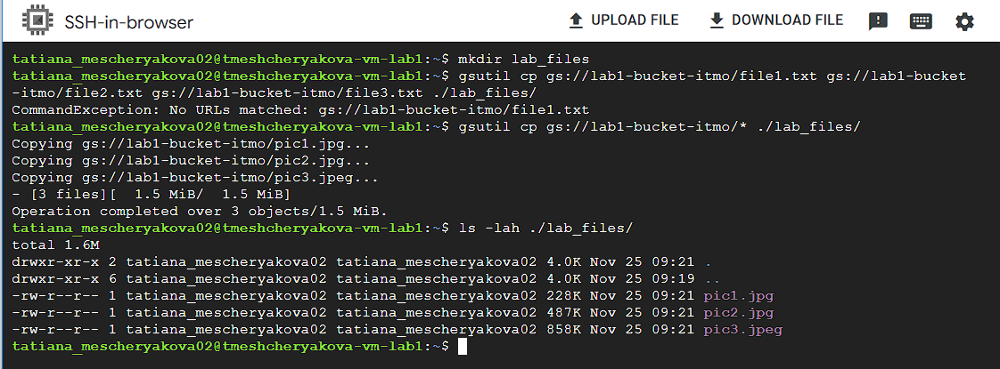

---

## 7. Эксперимент с IAM: смена роли

Я провела ключевой эксперимент, чтобы продемонстрировать прямое влияние роли SA на доступ к сервисам.

1.  **Смена роли:** Я вернулась в IAM, чтобы изменить права Service Account `tmescheryakova-sa-lab1`:
    * Я удалила роль **`Storage Admin`**.
    * Я добавила роль **`Compute Viewer`** (Просмотрщик Compute Engine), которая не дает никаких прав на Cloud Storage.
    
    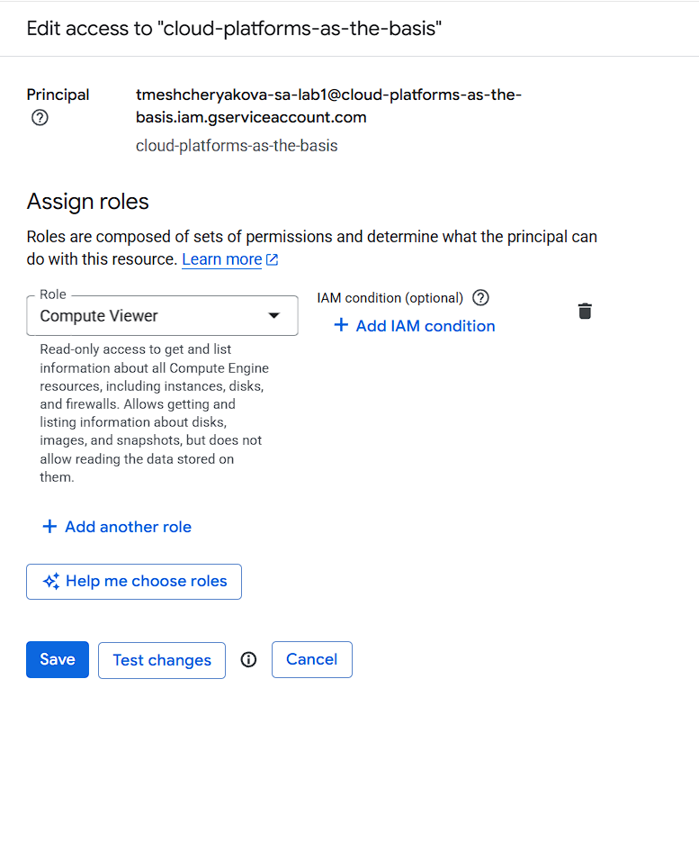

2.  **Повторная попытка копирования:** Сразу после смены роли я попыталась повторить команду копирования в SSH-консоли.

3.  **Результат (Ожидаемая ошибка):** Операция была немедленно заблокирована, что подтверждено ошибкой `403 Forbidden`.
    * **Ошибка:** `AccessDeniedException: 403 Forbidden. Permission 'storage.objects.list' denied...`
    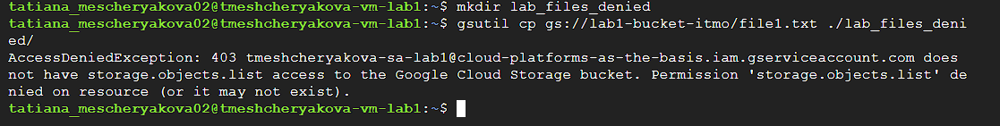

> **Вывод о политике IAM:** Права доступа в GCP не кэшируются и строго привязываются к текущей роли Service Account. Отзыв роли **`Storage Admin`** немедленно лишил VM возможности взаимодействовать с Cloud Storage, подтверждая принцип минимальных привилегий.

---

## 8. Удаление ресурсов

Для завершения лабораторной работы и исключения дальнейших списаний я удалила все созданные ресурсы.

1.  **Удаление VM:** Я удалила виртуальную машину `tmescheryakova-vm-lab1`.
    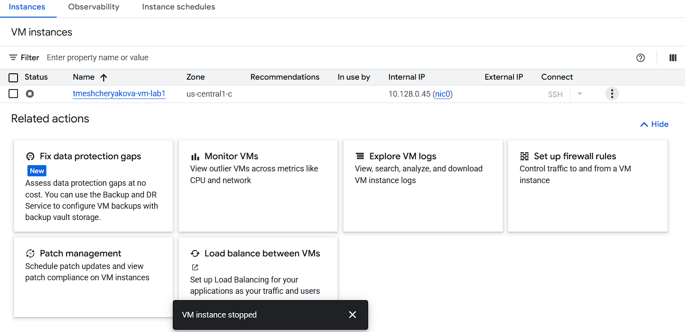
    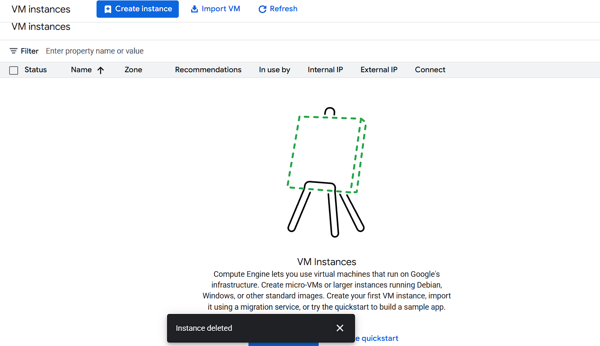
2.  **Удаление Service Account:** Я удалила Service Account `tmescheryakova-sa-lab1`.
    

---

## 9. Результаты лабораторной работы

Я успешно выполнила все требования, установленные методичкой:

✅ **GitHub-репозиторий** создан по правилам оформления.
✅ Все **обязательные файлы** (.gitignore, README.md, LICENSE) добавлены.
✅ Создан **service account** (`tmescheryakova-sa-lab1`).
✅ Создана **VM e2-micro (spot)** (`tmescheryakova-vm-lab1`).
✅ Файлы успешно скопированы через **gsutil**.
✅ **Проверено влияние IAM ролей** (успех с `Storage Admin` и отказ с `Compute Viewer`).
✅ Все созданные **ресурсы удалены** из проекта.
✅ Подготовлен полный отчёт с хронологической документацией.

---

## 10. Трудности и решения

| Проблема | Причина | Решение |
| :--- | :--- | :--- |
| **Ошибка gsutil: `No URLs matched`** | Я использовала точные имена файлов (`file1.txt`, `file2.txt`), которых не было в корне бакета `lab1-bucket-itmo`. Файлы имели другие имена (`pic1.jpg`, `pic2.jpg`). | Я скорректировала команду, используя подстановочный знак (`*`): `gsutil cp gs://lab1-bucket-itmo/* ./lab_files/`. |
| **Невозможность скачать файлы после смены роли** (Ошибка 403) | Я заменила роль `Storage Admin` на `Compute Viewer`. Роль `Compute Viewer` не включает разрешение `storage.objects.list`, необходимое для чтения содержимого бакета. | Это **ожидаемый результат** эксперимента, демонстрирующий принцип работы IAM. Решение — зафиксировать ошибку и сделать вывод. |

---
