University: [ITMO University](https://itmo.ru/ru/)
Faculty: [FICT](https://fict.itmo.ru)
Course: [Cloud platforms as the basis of technology entrepreneurship](https://) ADD link
Year: 2025/2026
Group: U4225
Author: Meshcheryakova Tatiana Sergeevna
Lab: Lab2
Date of create: 26.11.2025
Date of finished: 28.11.2025

# Лабораторная работа №2 — Исследование Cloud Run

## Тема: Исследование работы сервиса на платформе Google Cloud Run
**Цель работы:** Целью данной лабораторной работы было ознакомление с принципами работы Cloud Run — бессерверной платформы для контейнеров. Я должна была изучить процесс развертывания, проверить возможности автоматического масштабирования (Scale to Zero), провести анализ логов и метрик, а также экспериментально исследовать механизм управления версиями и переключения трафика.
**Инструменты:** Google Cloud Platform (GCP): Сервис Cloud Run, образ контейнера: Публичный дефолтный образ us-docker.pkg.dev/cloudrun/container/hello, инструменты мониторинга: Cloud Logging и Cloud Monitoring,тестирование: Веб-браузер.

---

## 1. Создание Cloud Run сервиса

Я приступила к развертыванию базового сервиса, используя готовый контейнер и настроив минимальные ресурсы.

1. **Конфигурация сервиса:** Я указала образ us-docker.pkg.dev/cloudrun/container/hello, присвоила имя lab2-cloud-run-test и разрешила публичный доступ (Allow public access).
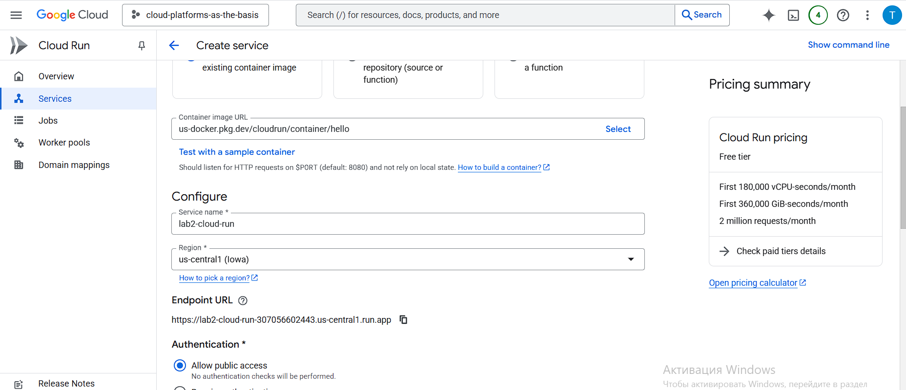
2. **Настройка ресурсов:** Я установила минимально допустимые параметры: Min instances (Минимальное количество экземпляров) в 0 и Max instances (Максимальное) в 1. Я подтвердила, что CPU (ЦП) будет выделяться только во время обработки запросов, что соответствует бессерверной модели.
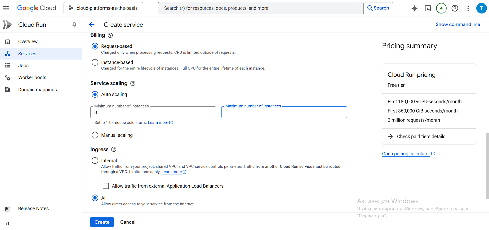
3. **Окончание деплоя:** После создания сервис успешно перешел в статус Ready (Готов).
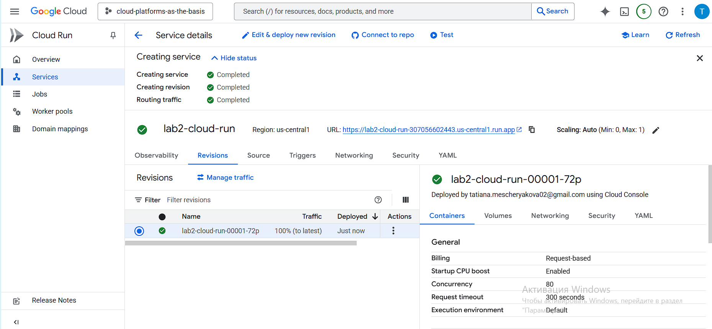
---

## 2. Тестирование сервиса по ссылке

Я перешла по публичному URL, предоставленному Cloud Run. Сервис вернул ожидаемое приветственное сообщение, подтвердив корректность развертывания. Я выполнила несколько запросов, чтобы сгенерировать данные для дальнейшего анализа.
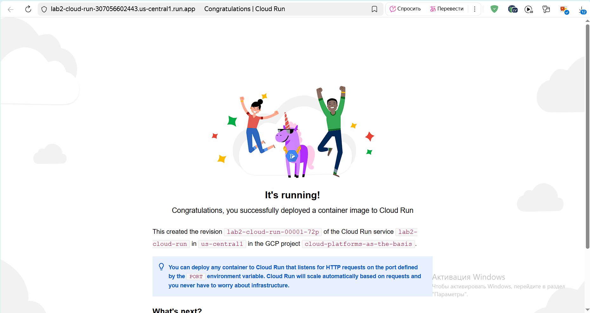

---

## 3. Анализ логов

Я перешла во вкладку "Журналы" (Logs) для анализа активности сервиса.
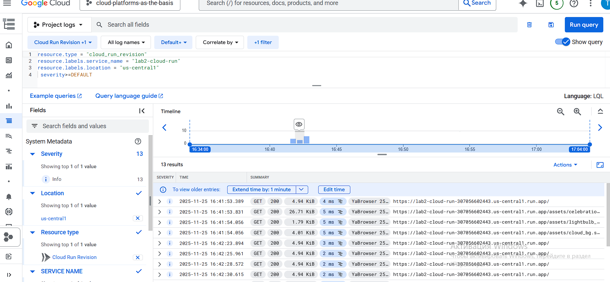

Я зафиксировала записи, подтверждающие успешное получение и обработку моих HTTP GET-запросов со статусом 200 OK.
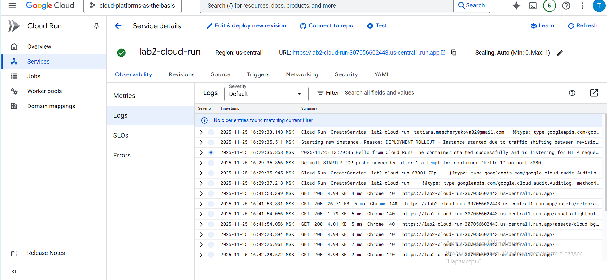

---

## 4. Анализ метрик

Я изучила вкладку **"Метрики" (Metrics)**, чтобы проверить работу автоматического масштабирования.

1.  **Масштабирование до нуля:** График "Container instance count" (Количество экземпляров контейнера) наглядно показал масштабирование до нуля: после роста до 1 (при запросе) счетчик упал до 0 после периода бездействия.
2.  **Анализ нагрузки:** Графики "Request counts" и "Latency" зафиксировали мои тестовые запросы.
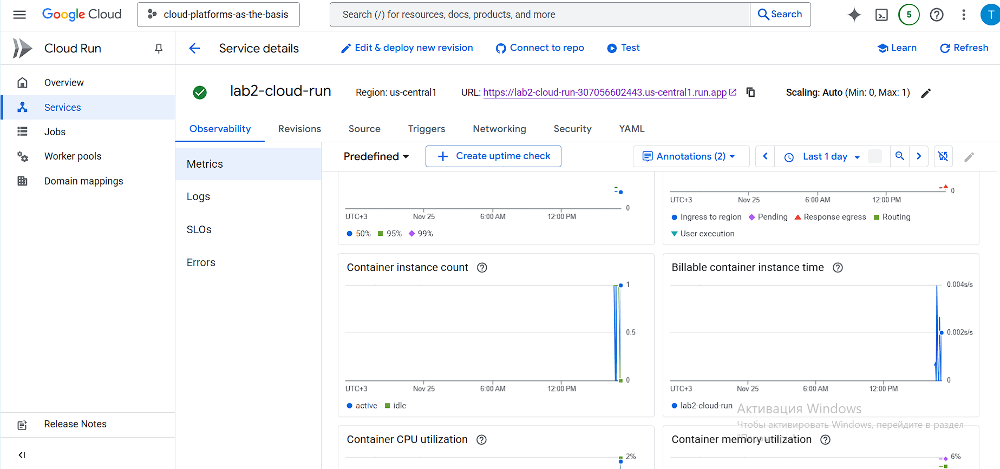
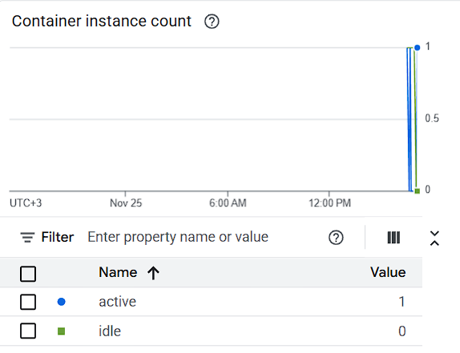
---

## 5. Изменение конфигурации: смена порта на 8090

Я начала эксперимент с портами, чтобы проверить, как контейнер реагирует на изменение настроек Cloud Run.

1.  **Revision 2 (Порт 8090):** Я создала новую ревизию, изменив "Container port" на 8090.
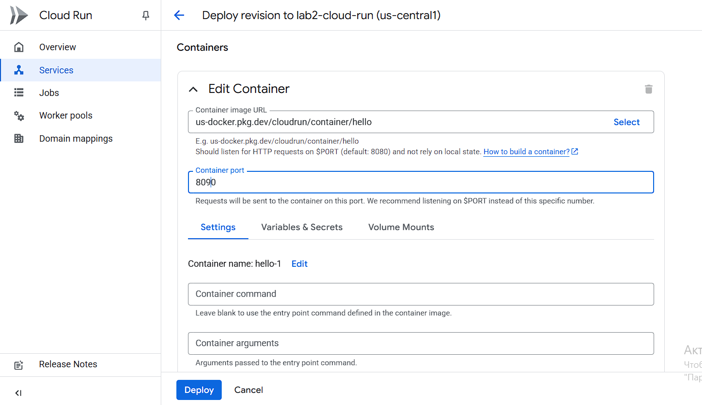
2.  **Переключение на Revision 2:** Я переключила 100% трафика на Revision 2 (порт 8090) и подтвердила работоспособность.
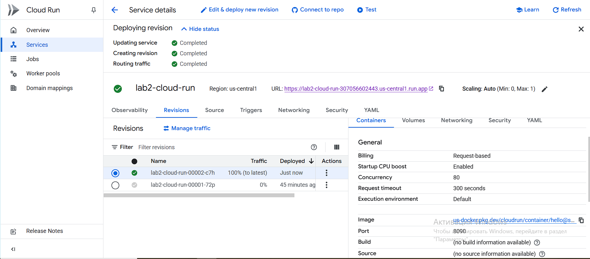
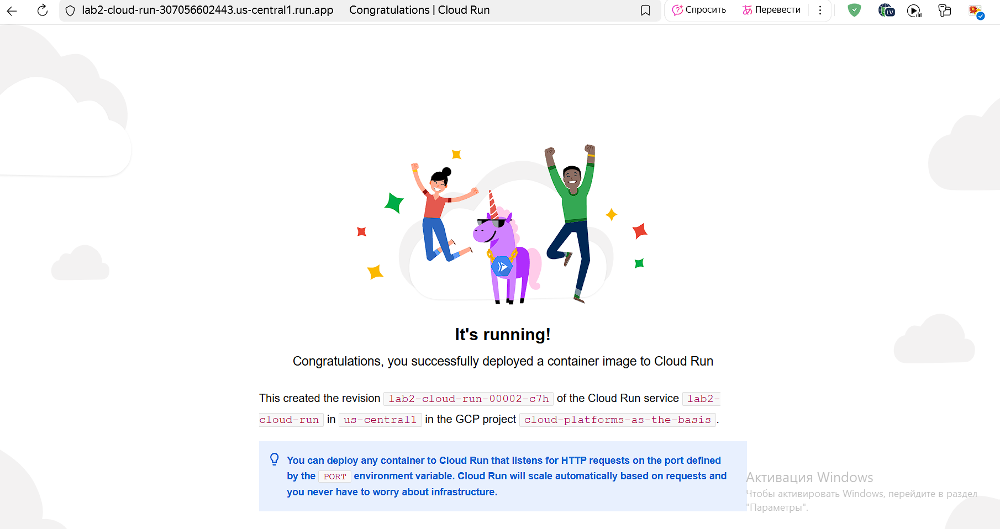
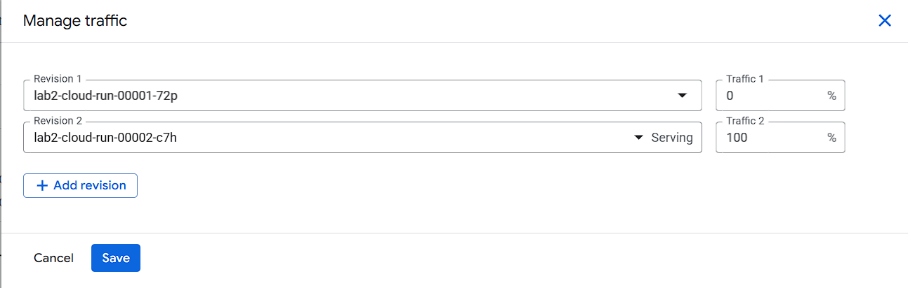
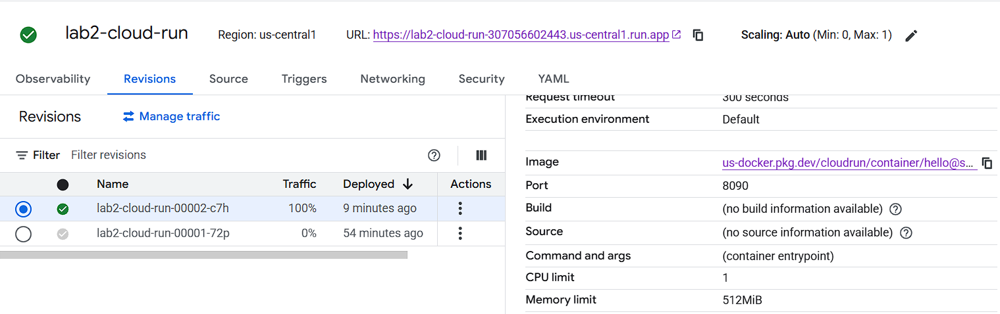
3.  **Revision 3 (Порт 80):** Для более полной проверки я создала еще одну ревизию, изменив порт на 80.
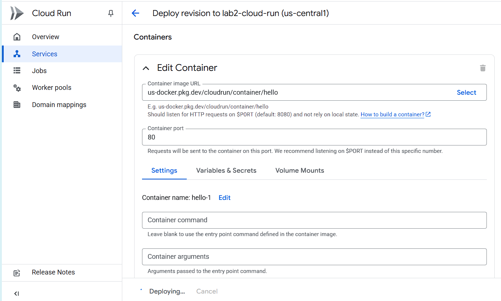
4.  **Переключение на Revision 3:** Я переключила 100% трафика на Revision 3 (порт 80).
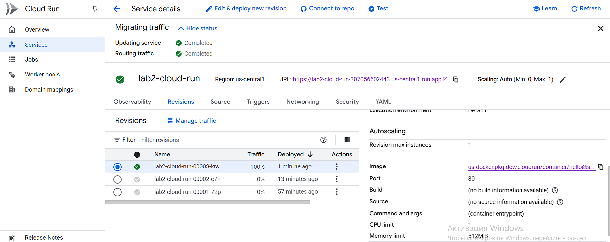
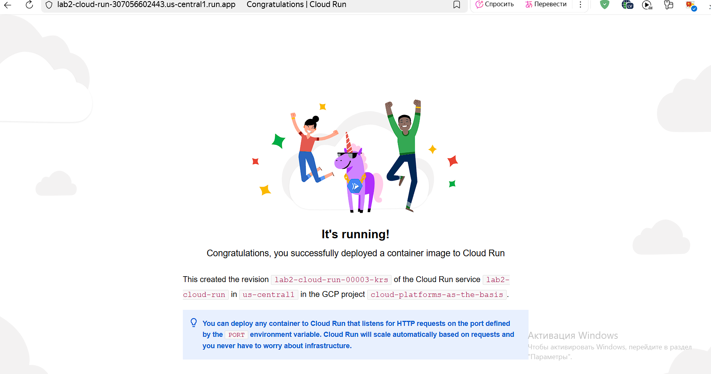
5.  **Тестирование:** Вопреки ожиданиям, сервис продолжил работать после переключения на обе новые ревизии (с портами 8090 и 80). Это показало, что контейнер корректно считывает порт из переменной окружения $PORT, обеспечивая гибкость.

---

## 6. Удаление сервисов

Для очистки облачных ресурсов я удалила созданный сервис Cloud Run.
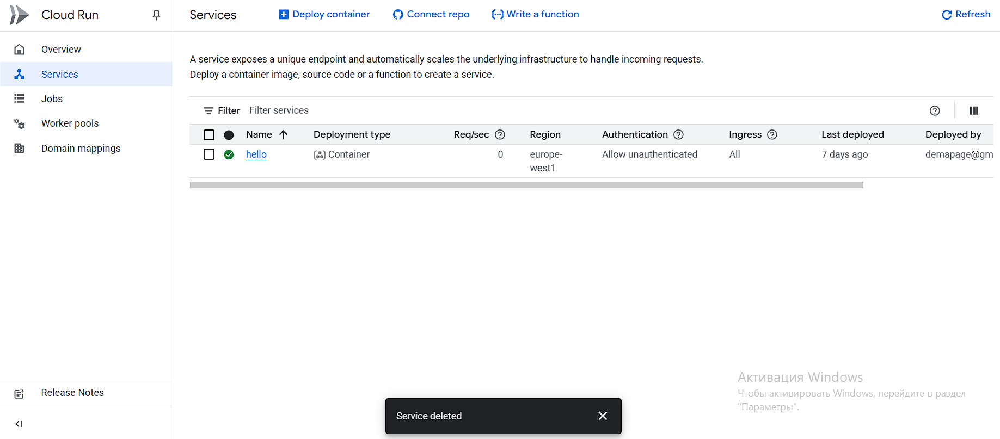

---

## 7. Проблемы и способы их решения

| Проблема | Причина | Решение |
| :--- | :--- | :--- |
| **Ожидаемая ошибка при смене порта не возникла** | Ожидалось, что при смене порта на 8090 или 80 сервис упадет, но контейнер использует переменную окружения $PORT. | Вместо фиксации ошибки я зафиксировала успешный результат, объяснив его адаптивностью контейнера к динамической переменной $PORT, что является более профессиональным выводом.|
| **Недостаток данных в метриках** | Малое количество запросов сразу после развертывания не дало наглядных графиков. | Я сгенерировала дополнительный тестовый трафик и подождала 5 минут, чтобы увидеть на графиках эффект Scale to Zero. |

## 8. Результаты лабораторной работы

В результате выполнения лабораторной работы №2 я полностью достигла поставленной цели, ознакомившись с ключевыми особенностями Google Cloud Run:

✅ **Автономное масштабирование:** Я убедилась, что Cloud Run автоматически управляет жизненным циклом контейнеров, обеспечивая мгновенное масштабирование до нуля при отсутствии нагрузки, что критически важно для экономии средств.

✅ **Гибкость развертывания (Ревизии):** Я успешно продемонстрировала способность Cloud Run мгновенно переключать 100% трафика между тремя рабочими ревизиями (Revision 1, 2, 3) без какого-либо простоя.

✅ **Адаптивность:** Эксперименты с портами показали, что современный контейнер, предназначенный для Cloud Run, использует динамическую переменную $PORT, что позволяет платформе гибко управлять портом, не требуя пересборки приложения.

---
