University: [ITMO University](https://itmo.ru/ru/)
Faculty: [FICT](https://fict.itmo.ru)
Course: [Cloud platforms as the basis of technology entrepreneurship](https://) ADD link
Year: 2025/2026
Group: U4225
Author: Meshcheryakova Tatiana Sergeevna
Lab: Lab1
Date of create: 25.11.2025
Date of finished: 25.11.2025

# Лабораторная работа №1 — Обзор Google Cloud и исследование основных сервисов

## Тема: Базовые возможности Google Cloud
**Цель работы:** Ознакомиться с основными понятиями и принципами работы облачного хранилища, изучить различные модели хранения данных (объектное хранилище), познакомиться с основными сервисами и функционалом, предоставляемым облачными хранилищами, в частности, настройкой публичного доступа и управлением жизненным циклом ресурсов.
**Инструменты:** Google Cloud Console (Веб-интерфейс), сервис Google Cloud Storage (GCS), веб-браузер

---

## 1. Создание Cloud Storage bucket

Для выполнения работы был выбран существующий проект, в котором имеются соответствующие права доступа.
.png)

Произведено создание бакета с уникальным именем lab3-storage-tmeshcheryakova и определенными политиками.

1.  **Имя и регион:** Указано уникальное имя и выбран регион us-central1 (Iowa).
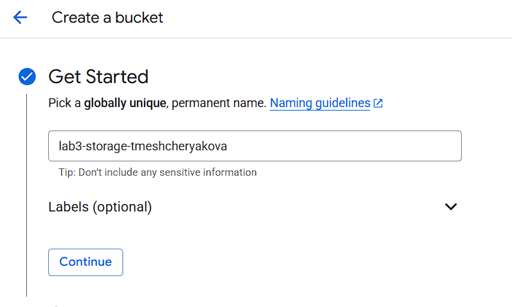
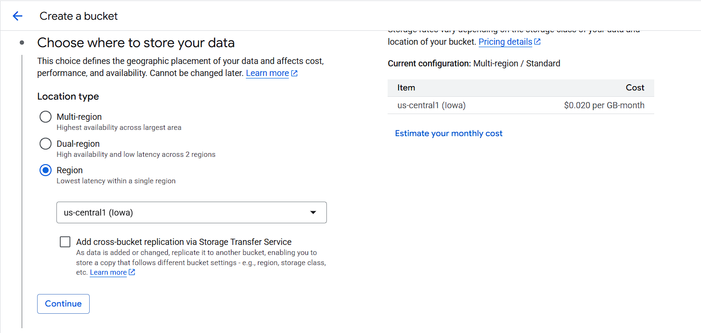
3.  **Класс хранения и доступ:** Выбран класс хранения Standard и изначально установлен режим контроля доступа Детальный (Fine-grained).

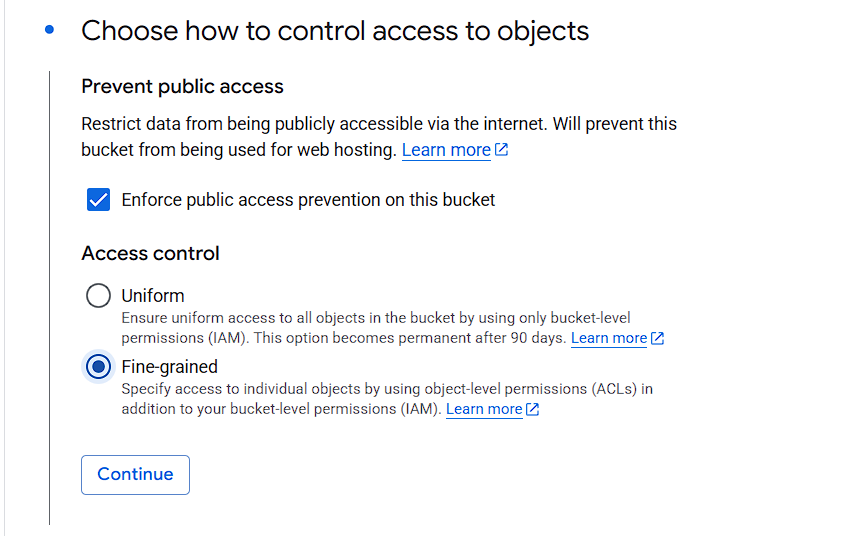
5.  **Создание:** После настройки политики Soft delete и окончательной проверки бакет был успешно создан.

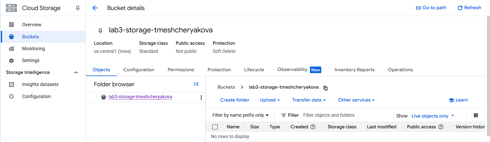

---

## 2. Загрузка 3–4 изображений

В созданный бакет были загружены три тестовых изображения: 1.jpg, 3.jpg, и 4.jpg.

---

## 3. Создание папки и перемещение файлов

Для организации данных внутри объектного хранилища была создана папка, и загруженные файлы были в нее перемещены.

1.  **Создание папки:** Создана папка с именем lab-files.
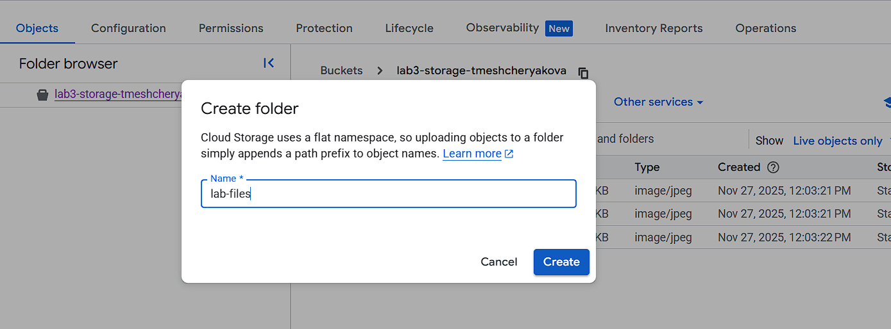
3.  **Перемещение:** Выбраны файлы и инициирована операция перемещения в папку lab-files/.
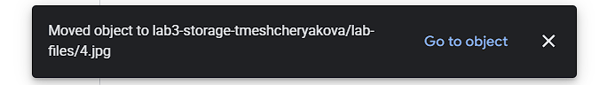

---

## 4. Настройка публичного доступа

Был использован механизм Объединенного доступа (Uniform access) через IAM, который требует настройки разрешений на уровне бакета.

1.  **Начало настройки:** Переход во вкладку "Разрешения" (Permissions) и нажатие "ПРЕДОСТАВИТЬ ДОСТУП" (Grant Access).
2.  **Добавление участника и роли:** В качестве участника указан allUsers, а роль установлена "Читатель объектов Storage" (Storage Object Reader).
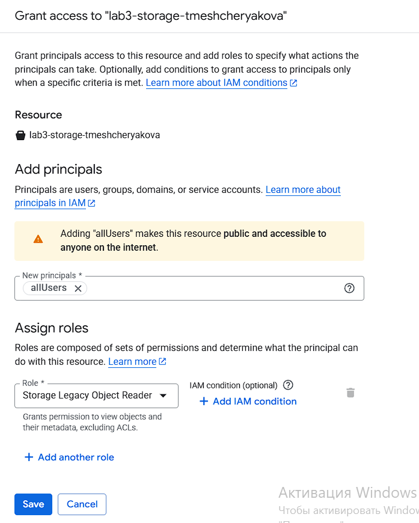
4.  **Финальный вид разрешений:** Успешное добавление публичного доступа.
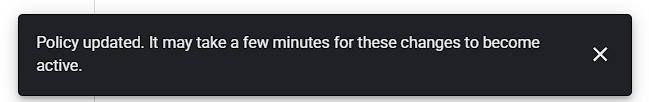
   
---

## 5. Генерация публичных ссылок

После настройки публичного доступа получена прямая ссылка на файл. 
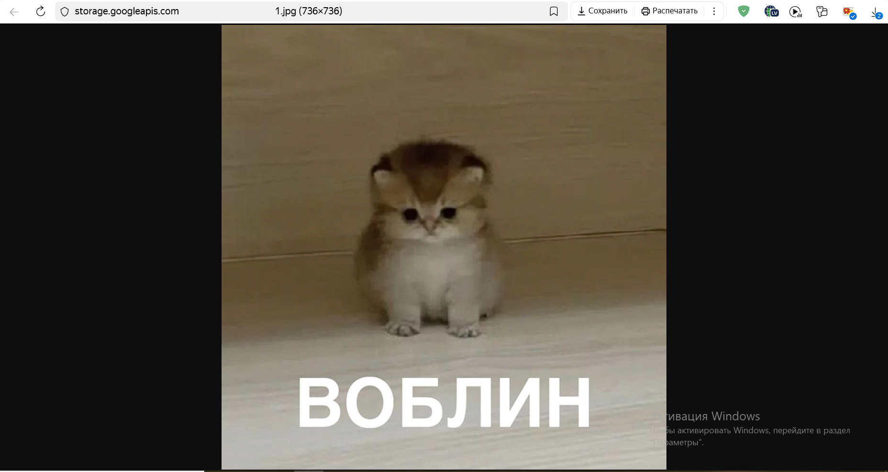

---

## 6. Удаление ресурсов

В конце работы все созданные ресурсы были удалены.
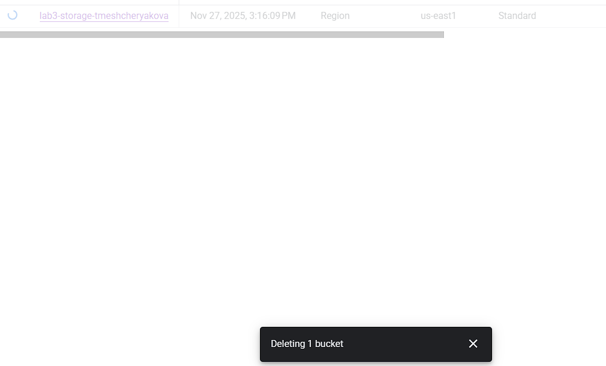

--- 

## 7. Трудности и решения

| Проблема | Причина | Решение |
| :--- | :--- | :--- |
| Невозможность настройки ACL | Несмотря на выбор "Детальный" при создании, бакет использовал Объединенный (Uniform) доступ. | Переход к современному методу: настройка публичного доступа через IAM (добавление allUsers с ролью "Читатель объектов Storage") на уровне бакета.|
| Невозможность перемещения/удаления | Платежный аккаунт был временно закрыт/приостановлен (Your billing account closed). | Создание нового бакета. |

>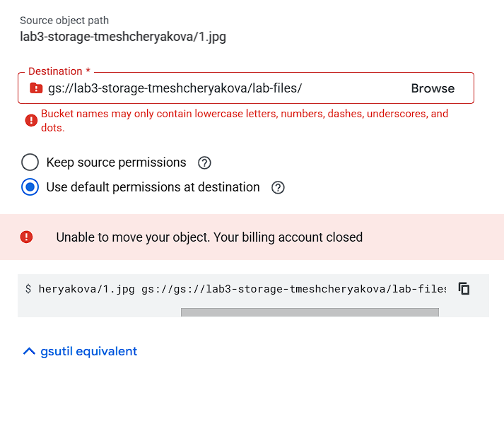
>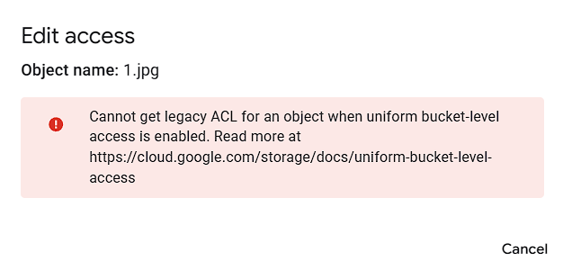

---
## 8. Выводы
>В ходе лабораторной работы были изучены ключевые аспекты работы с Google Cloud Storage. Получены навыки создания и конфигурирования бакетов, а также организации объектных данных. Критически важным навыком стала настройка публичного доступа к объектам с использованием IAM, что является рекомендуемой практикой в GCP при включенном Объединенном контроле доступа. Также была продемонстрирована необходимость контроля состояния платежного аккаунта для бесперебойной работы с облачными сервисами. Cloud Storage подтвердил свою эффективность как отказоустойчивое и гибкое объектное хранилище.
