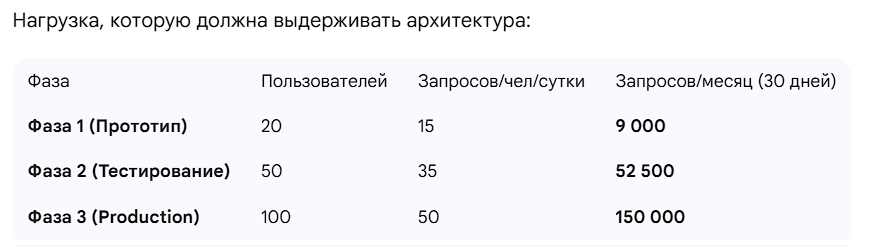
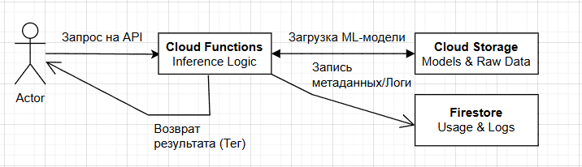
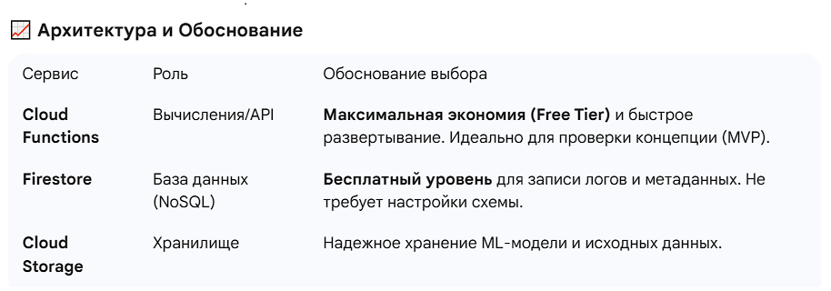
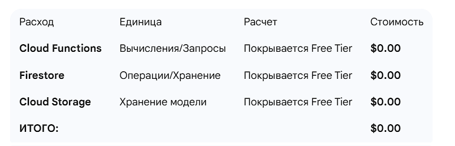
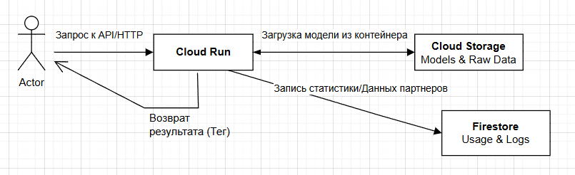
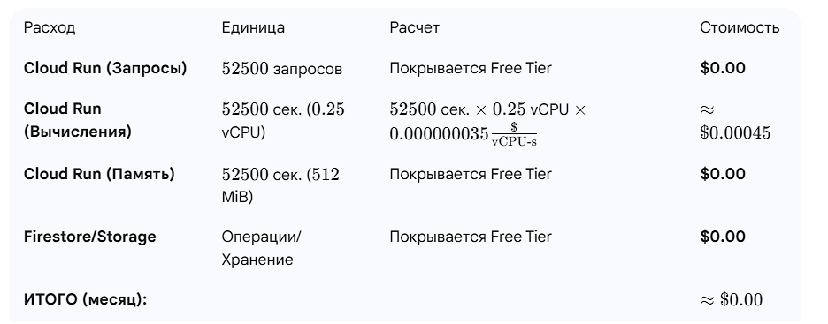
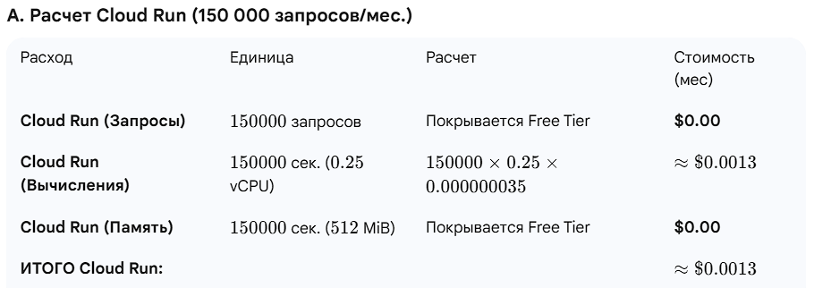
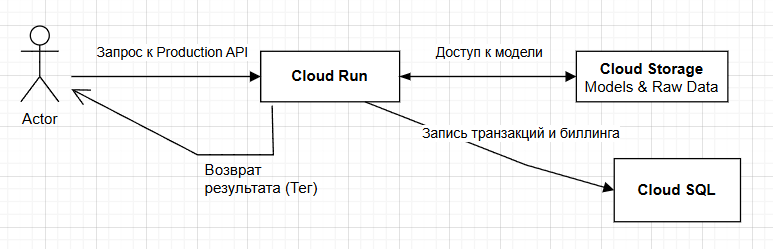

University: [ITMO University](https://itmo.ru/ru/)
Faculty: [FICT](https://fict.itmo.ru)
Course: [Cloud platforms as the basis of technology entrepreneurship](https://) ADD link
Year: 2025/2026
Group: U4225
Author: Meshcheryakova Tatiana Sergeevna
Lab: Lab4
Date of create: 02.12.2025
Date of finished: 02.12.2025

# Лабораторная работа №4: Разработка инфраструктуры MVP AI приложения

**Цель работы:** Целью лабораторной работы является создание схемы инфраструктуры MVP AI-приложения ("Интеллектуальный классификатор изображений") с оптимизацией расходов на всем жизненном цикле.

---

## 1. Исходные данные и Тип решения

| Параметр| Значение | Обоснование |
| :--- | :--- | :--- |
| Тип ML-решения | Инференс | Выбрано для минимизации вычислительных требований и простоты MVP.|
| Выбранный тип | Гибридное Бессерверное API | Обеспечивает максимальную гибкость (PWA/Mobile) и позволяет плавно переходить от Free Tier к Production-решению (Cloud SQL HA). |
| Базовая конфигурация | $0.25$ vCPU, $512$ MiB RAM |Самая экономичная конфигурация для Cloud Run.|

 

---

## 2. Обоснование выбранной нагрузки

Я рассчитала нагрузку, исходя из минимального числа пользователей (MVP) и постепенного роста до целевого состояния Production.

---

## 3. Прототип

На этой фазе основная цель — доказать концепцию (MVP) с нулевыми затратами.

1.  **API/Вычисления:** Я выбрала Cloud Functions. Это самый быстрый способ развернуть инференс-логику и, что самое важное, он полностью покрывается бесплатным уровнем (Free Tier) GCP.
2.  **Хранение данных:** Модель и сырые данные хранятся в Cloud Storage.
3.  **Логи/Метаданные:** Использую Firestore (NoSQL) для записи логов, поскольку он также имеет щедрый бесплатный лимит и не требует сложной настройки.
4.  **Фронтенд:** Внешнее PWA-приложение взаимодействует напрямую с API Cloud Functions.

 
 

**Финансовый расчет (FinOps) для 9 000 запросов/мес.**
При такой низкой нагрузке все сервисы попадают в Free Tier.
 

---

## 4. Тестирование партнерами

На этой фазе я перехожу на более устойчивую платформу для работы со сложными ML-зависимостями, сохраняя экономичность.

1.  **API/Вычисления:** Переход на Cloud Run. Cloud Run позволяет размещать контейнеры (Docker) с необходимыми ML-библиотеками, сохраняя при этом критическое преимущество масштабирования до нуля (Min instances: 0).
2.  **База данных:** Firestore остается для логов и статистики.

 
  

**Финансовый расчет (FinOps) для 52 500 запросов/мес.**
Cloud Run покрывает первые 2 миллиона запросов и $180 000$ vCPU-секунд ежемесячно бесплатно.
 
 

---

## 5. Production

На этой фазе основное внимание уделяется Высокой Доступности (HA) и надежности транзакций для биллинга.

1. **API/Вычисления:** Cloud Run остается. Это оптимальное решение, поскольку оно обеспечивает лучшую экономическую эффективность, чем постоянно работающий кластер GKE.
2. **База данных:** Cloud SQL (HA). Это ключевое усложнение. Firestore не может гарантировать ACID-свойства и HA на уровне, необходимом для финансового учета (биллинга). Cloud SQL с репликацией HA становится основным, постоянно работающим, а следовательно, самым дорогим ресурсом.
3. **Защита:** В идеальной Production-схеме здесь также необходимо добавить Cloud Armor для защиты публичного API (Cloud Run).

**Финансовый расчет (FinOps) для 150 000 запросов/мес.**
На этом этапе мы наконец превышаем расходы $0.00, что связано с постоянно работающим Cloud SQL.

 
> ИТОГО  

---

## 8. Выводы
>Выбор Гибридного Бессерверного API был оптимальным. Мы успешно достигли следующих целей:

**Начали с нуля:** Затраты в Фазах 1 и 2 были близки к нулю благодаря Free Tier.

**Обосновали переход:** Переход на Cloud Run был оправдан необходимостью работать с контейнерами (ML-модели).

**Идентифицировали основной расход:** В Production основной расход — это не масштабируемое ядро (Cloud Run), а постоянно работающий и надежный ресурс (Cloud SQL HA), который необходим для выполнения бизнес-требований. Это подтверждает принцип, что самое дешевое решение в начале не всегда оптимально в конце.
